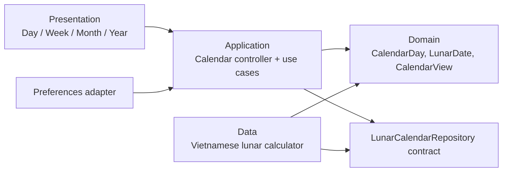

# Kiến trúc ứng dụng Lịch Việt

## 1. Mục tiêu kiến trúc

- Xem lịch theo ngày, tuần, tháng và năm với ngày âm đi kèm.
- Hoạt động ngoại tuyến cho chức năng xem lịch cốt lõi.
- Thuật toán ngày âm có thể kiểm thử và thay thế mà không ảnh hưởng UI.
- Dễ mở rộng sau này cho ngày lễ, sự kiện cá nhân, widget hệ điều hành và đồng bộ.

## 2. Lựa chọn tổng thể

Áp dụng **feature-first architecture** với ranh giới kiểu Clean Architecture vừa đủ. Giai đoạn đầu chỉ có feature `calendar`; không tạo abstraction hoặc package quản lý state trước khi có nhu cầu thực tế.



Quy tắc phụ thuộc quan trọng: `domain` không biết Flutter, UI, package lưu trữ hoặc chi tiết thuật toán.

## 3. Cấu trúc mã nguồn

```text
lib/
  main.dart
  app/
    calendar_app.dart
    theme/
    routing/
  core/
    date_time/
      clock.dart
      date_only.dart
    errors/
  features/calendar/
    domain/
      entities/calendar_day.dart
      value_objects/lunar_date.dart
      value_objects/calendar_view.dart
      repositories/lunar_calendar_repository.dart
    application/
      calendar_state.dart
      calendar_controller.dart
      use_cases/get_day.dart
      use_cases/get_period.dart
    data/
      vietnamese_lunar_calendar.dart
      local_calendar_repository.dart
    presentation/
      pages/calendar_page.dart
      widgets/day_view.dart
      widgets/week_view.dart
      widgets/month_view.dart
      widgets/year_view.dart
      widgets/calendar_cell.dart
  features/notifications/
    domain/                      # NotificationService contract
    application/                 # Lập lịch + state cài đặt thông báo
    data/                        # Plugin thông báo + SharedPreferences adapter
    presentation/                # Trang Cài đặt
```

Test phản chiếu cấu trúc `lib` trong `test/`; test fixture dùng chung đặt trong `test/support`.

## 4. Mô hình domain tối thiểu

- `CalendarView`: `day`, `week`, `month`, `year`.
- `LunarDate`: ngày, tháng, năm âm và cờ tháng nhuận.
- `CalendarDay`: ngày dương đã chuẩn hóa, `LunarDate`, trạng thái hôm nay/được chọn, và metadata ngày lễ nếu có.
- `LunarCalendarRepository`: chuyển ngày dương sang ngày âm; có thể bổ sung chiều ngược lại sau.
- `Clock`: cung cấp “bây giờ” để logic hôm nay kiểm thử được.

State màn hình tối thiểu gồm `selectedDate`, `visibleAnchor`, `view` và trạng thái lỗi. Chuyển view không làm mất ngày đang chọn; `visibleAnchor` được chuẩn hóa theo phạm vi đang xem.

## 5. Luồng dữ liệu

1. Người dùng chọn ngày hoặc đổi chế độ xem.
2. Controller chuẩn hóa ngày và xác định khoảng cần hiển thị.
3. Use case yêu cầu repository tạo `CalendarDay` cho khoảng đó.
4. Data layer tính ngày âm cục bộ theo UTC+7.
5. Controller phát state bất biến; presentation chỉ render state và gửi intent.

Không cần database cho MVP. Chỉ lưu tùy chọn nhẹ như chế độ xem gần nhất/theme khi yêu cầu sản phẩm được chốt.

Thông báo cục bộ nằm trong feature `notifications`, không gọi plugin trực tiếp từ widget. Người dùng chủ động bật/tắt lịch nhắc trong trang Cài đặt; lựa chọn được lưu bằng `NotificationPreferenceRepository`. Khi bật hoặc khi mở lại ứng dụng với lựa chọn đang bật, scheduler tạo lại lịch nhắc trong 370 ngày tiếp theo lúc 08:00 theo `Asia/Ho_Chi_Minh`: một thông báo vào ngày trước và một thông báo đúng ngày mùng 1/Rằm. Khi tắt, toàn bộ lịch nhắc của ứng dụng được hủy. Android dùng lịch không chính xác tuyệt đối (`inexactAllowWhileIdle`) để không yêu cầu quyền báo thức chính xác; hệ điều hành có thể giao thông báo trễ nhẹ để tối ưu pin.

`NotificationSettingsController` cập nhật trạng thái công tắc theo hướng optimistic và phát trạng thái đang xử lý trước khi gọi native API. Scheduler nhường frame định kỳ trong lúc quét ngày để không làm khựng animation; nếu quyền bị từ chối hoặc nền tảng không hỗ trợ, controller trả công tắc về trạng thái tắt.

## 6. Chiến lược kiểm thử

- **Unit test:** chuẩn hóa ngày, biên tuần/tháng/năm, chuyển view, thuật toán âm lịch.
- **Contract test:** mọi implementation của `LunarCalendarRepository` phải trả cùng kết quả chuẩn.
- **Widget test:** cell hiển thị đồng thời ngày dương/ngày âm, chọn ngày, về hôm nay và đổi view.
- **Golden test:** chỉ thêm sau khi hệ thống màu/chữ được chốt để tránh snapshot dễ vỡ.
- **Integration test:** một luồng chính: mở app, đổi tháng, chọn ngày, đổi sang tuần/ngày.

Các ca âm lịch bắt buộc gồm ngày Tết đã xác minh, ngày trước/sau Tết, tháng nhuận và mốc biên của miền hỗ trợ. Nguồn đối chiếu và miền hỗ trợ phải được ghi cạnh test fixture.

## 7. Quyết định UI ban đầu cần chốt

- Thanh trên: tên khoảng thời gian, nút lùi/tiến, nút “Hôm nay”.
- Bộ chuyển `Ngày / Tuần / Tháng / Năm` đặt ngay dưới thanh trên.
- Ô lịch: ngày dương lớn, ngày âm nhỏ; hôm nay dùng viền/điểm nhấn, ngày chọn dùng nền đặc.
- Cuối màn hình: vùng thông tin ngày đã chọn; không dùng bottom navigation vì bốn chế độ là bốn cách xem cùng một nội dung.
- Màu đề xuất: nền trắng ngà, chữ xanh than, màu nhấn đỏ son vừa phải; Chủ nhật và ngày lễ có nhấn nhưng vẫn đạt tương phản.

## 8. Lộ trình triển khai

1. Chốt wireframe, typography và màu.
2. Tạo domain model, `Clock`, calculator interface và unit test.
3. Triển khai thuật toán âm lịch Việt Nam cùng bộ regression test được đối chiếu.
4. Làm Month view trước, rồi tái sử dụng cell/state cho Week, Day và Year.
5. Thêm widget/integration test, accessibility và tối ưu hiệu năng.
